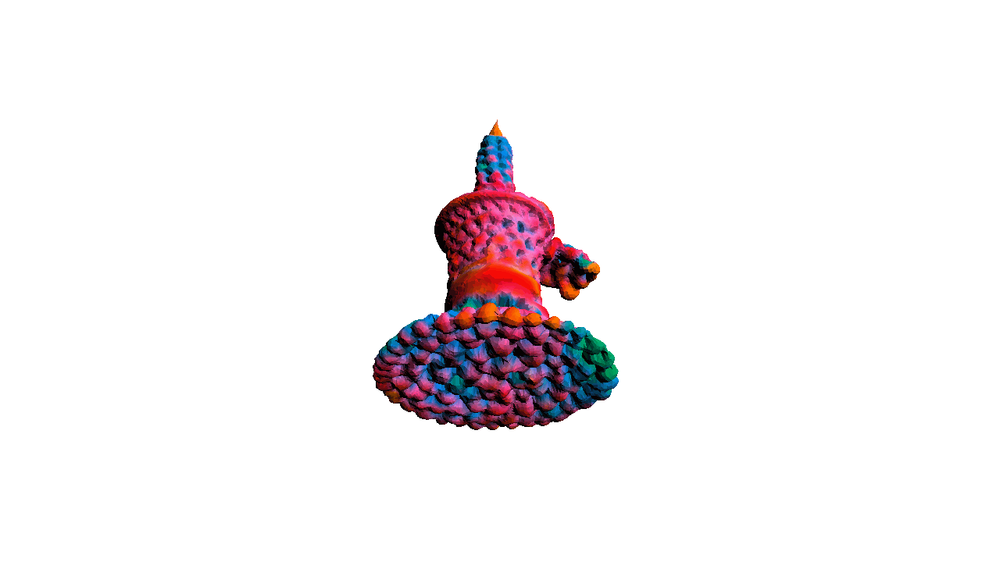
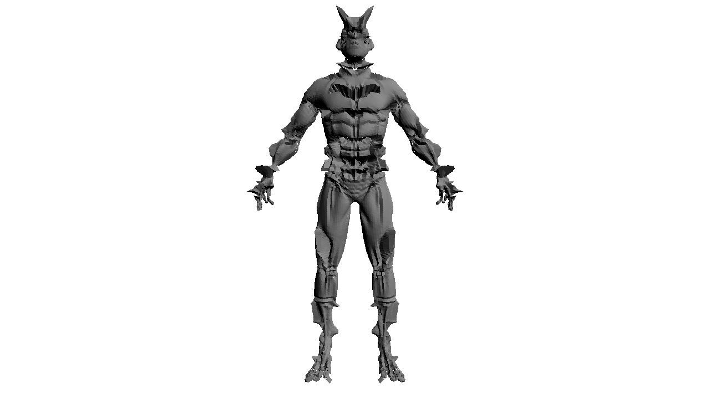
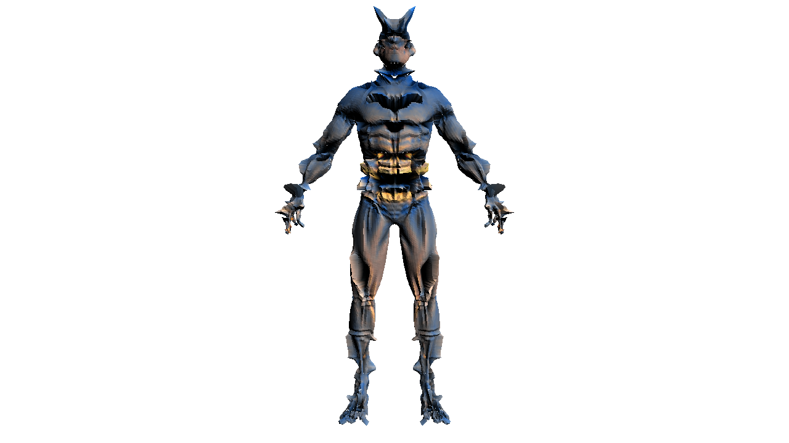
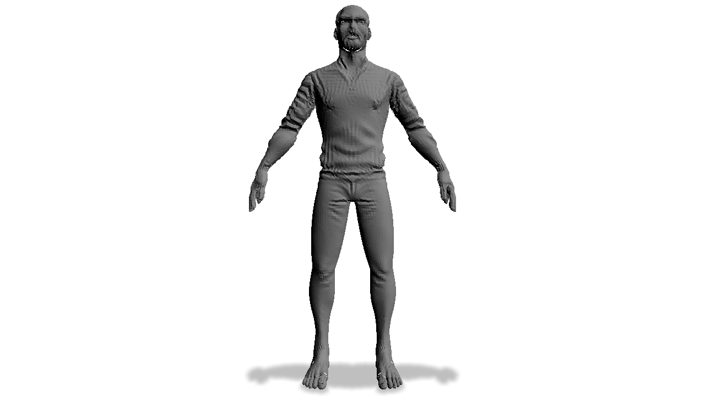
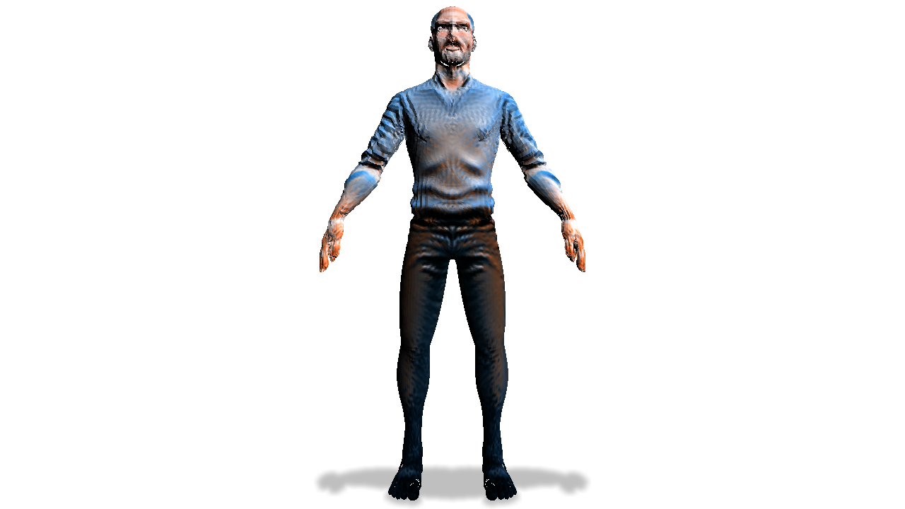
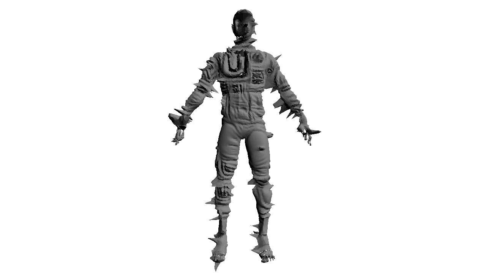
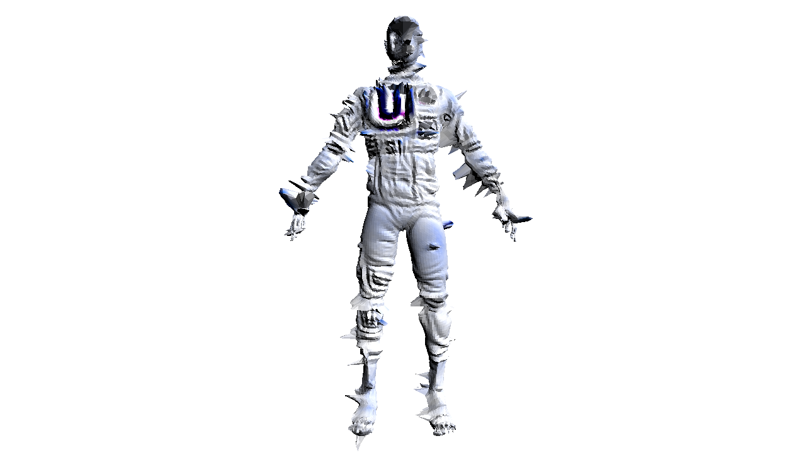

# Text2Mesh
[](https://arxiv.org/abs/1234.56789)

**Text2Mesh** is a method for text-driven stylization of a 3D mesh, as described in "Text2Mesh: Text-Driven Neural Stylization for Meshes" (forthcoming).

## Installation
<details>
  <summary>Getting started _[click to expand]_</summary>

**Note:** The below installation will fail if run on something other than a CUDA GPU machine.
```
conda env create --file text2mesh.yml
conda activate text2mesh
```

## System Requirements
- Python 3.7
- CUDA 10.2
- GPU w/ minimum 8 GB ram
</details>

## Run examples
Call the below shell scripts to generate example styles. 
```bash
# batman 
./demo/run_batman.sh
# astronaut 
./demo/run_astronaut.sh
# steve jobs 
./demo/run_jobs.sh
# shoe made of cactus 
./demo/run_shoe.sh
# colorful crochet vase 
./demo/run_vase.sh
```
The outputs will be saved to `results/demo`, with the stylized .obj files, colored and uncolored render views, and screenshots during training.

#### Outputs
<p float="center">



</p>

<p float="center">



</p>

<p float="center">



</p>

<p float="center">


</p>

<p float="center">


</p>

## Citation
```
@article{text2mesh,
    author = {Michel, Oscar
              and Bar-On, Roi
              and Liu, Richard
              and Benaim, Sagie
              and Hanocka, Rana
              },
    title = {{Text2Mesh: Text-Driven Neural Stylization for Meshes}},
    journal = {TODO: ARXIV},
    year  = {2021}
}
```
