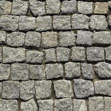
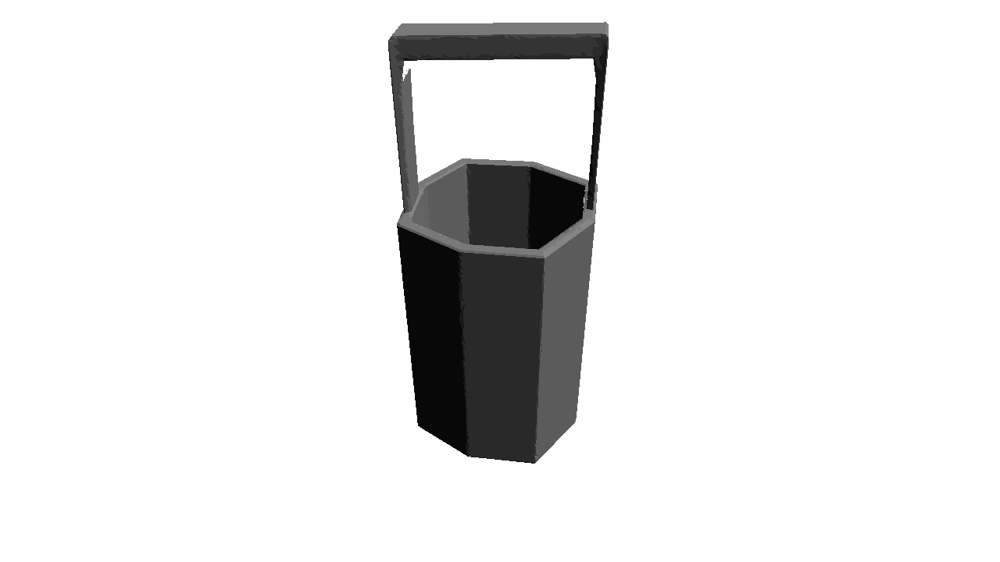
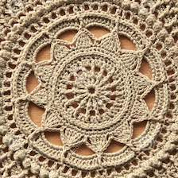
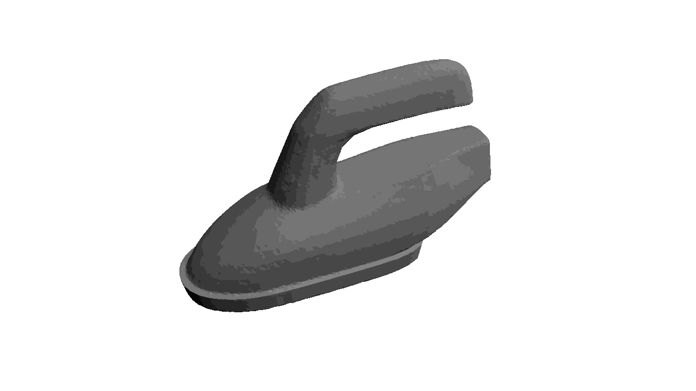
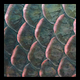
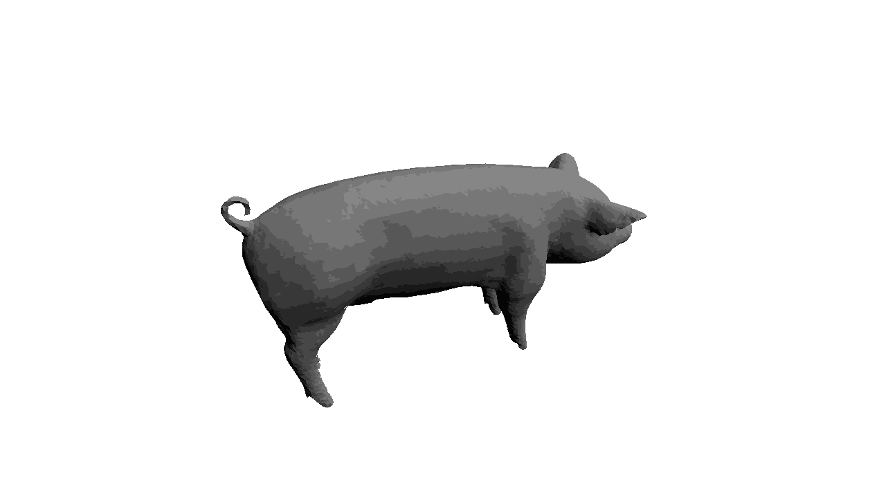
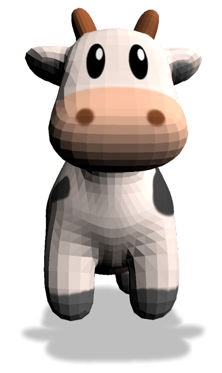
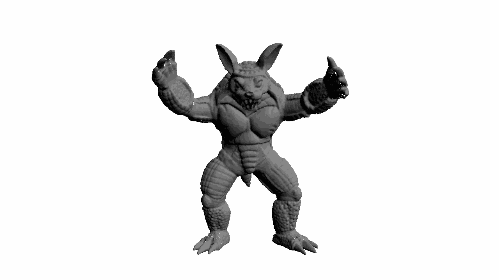

<center>

  
<p><em>
Text2Mesh produces color and geometric details over a variety of source meshes, driven by a target text prompt. Our stylization results coherently blend unique and ostensibly unrelated combinations of text, capturing both global semantics and part-aware attributes.
</em></p>

</center>

* * *

## Abstract

In this work, we develop intuitive controls for editing
the style of 3D objects. Our framework, Text2Mesh, stylizes a 3D mesh by predicting color and local geometric details which conform to a target text prompt. We consider
a disentangled representation of a 3D object using a fixed
mesh input (content) coupled with a learned neural network, which we term neural style field network. In order
to modify style, we obtain a similarity score between a text
prompt (describing style) and a stylized mesh by harnessing the representational power of CLIP. Text2Mesh requires
neither a pre-trained generative model nor a specialized
3D mesh dataset. It can handle low-quality meshes (non-manifold, boundaries, etc.) with arbitrary genus, and does
not require parameterization. We demonstrate the ability of our technique to synthesize a myriad of styles over a
wide variety of 3D meshes.

## Overview
<center>


<p><em>The pipeline of our method</em></p>

</center>


## Multiple views
Even though our method is based on [CLIP](https://openai.com/blog/clip/), a joint model of image and text, it is able to produce coherent, consistent, and sensible results across multiple views.
<center>

<p><em>Ironman from any azimuth </em></p>

</center>

## Morphs
_NSF_ is capable of generating small deformations over the same source mesh, based on different targets. Thus, it's very natural to morph different results.

<center>
 
 
 
 
</center>

## Coupling
We observe a strong correlation between the displacements and the coloring that _NSF_ produces, which results in a consistent stylized 3D mesh.

<center>
 
</center>

## Beyond Text-Driven Manipulation
We further leverage the joint vision-language embedding space to guide our optimization with other targets: images and meshes.

### Target Image
<center>
 
 
 
 
 
 
</center>

### Target Mesh
<center>
 
 
</center>

## Citation
```
@article{text2mesh,
    author = {Michel, Oscar
              and Bar-On, Roi
              and Liu, Richard
              and Benaim, Sagie
              and Hanocka, Rana
              },
    title = {{Text2Mesh: Text-Driven Neural Stylization for Meshes}},
    journal = {TODO: ARXIV},
    year  = {2021}
}
```