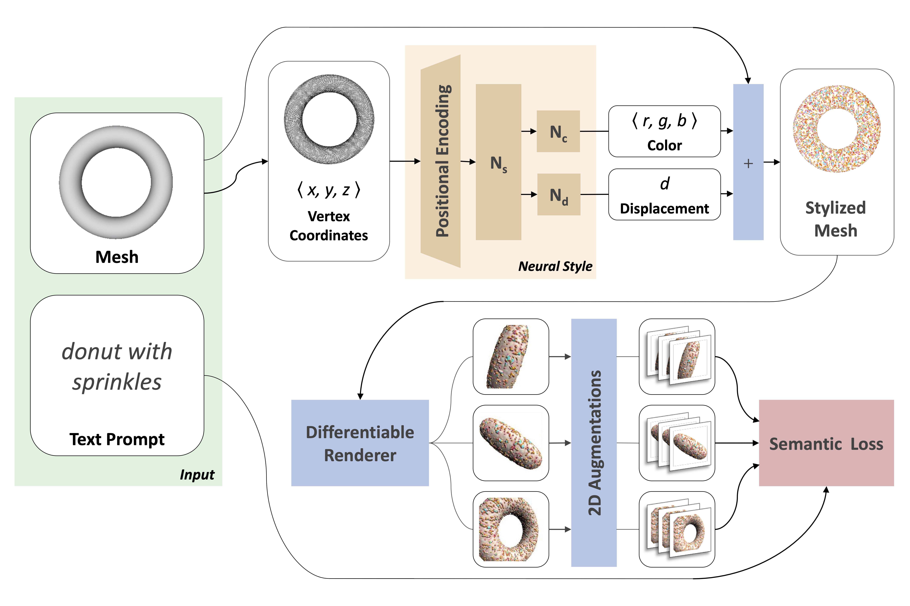

<center>
<!-- <figure style="display:inline-block;margin:0;padding:0"><figcaption style="text-align:center">Iron Man</figcaption></figure>
<figure style="display:inline-block;margin:0;padding:0"><figcaption style="text-align:center">Colorful Crochet Candle</figcaption></figure>
<figure style="display:inline-block;margin:0;padding:0"><figcaption style="text-align:center">Brick Lamp</figcaption></figure>
<figure style="display:inline-block;margin:0;padding:0"><figcaption style="text-align:center">Astronaut Horse</figcaption></figure> -->
<figure style="display:inline-block;margin:0;padding:0"><video id='t1' width="150" controls='controls'><source src="figures/teaser/ironman_inset.mp4" alt="ironman"/></video><figcaption style="text-align:center">Iron Man</figcaption></figure>
<figure style="display:inline-block;margin:0;padding:0"><video id='t2' width="150" controls='controls'><source src="figures/teaser/candle_inset.mp4" alt="a candle made of colorful crochet"/></video><figcaption style="text-align:center">Colorful Crochet Candle</figcaption></figure>
<figure style="display:inline-block;margin:0;padding:0"><video id='t3' width="250" controls='controls'><source src="figures/teaser/lamp_inset.mp4" alt="a lamp made of brick"/></video><figcaption style="text-align:center">Brick Lamp</figcaption></figure>
<figure style="display:inline-block;margin:0;padding:0"><video id='t4' width="200" controls='controls'><source src="figures/teaser/horse_inset.mp4" alt="a horse wearing an astronaut suit"/></video><figcaption style="text-align:center">Astronaut Horse</figcaption></figure>

<p><em>
Text2Mesh produces color and geometric details over a variety of source meshes, driven by a target text prompt. Our stylization results coherently blend unique and ostensibly unrelated combinations of text, capturing both global semantics and part-aware attributes.
</em></p>

<a href="https://github.com/threedle/text2mesh" class="btn">Code</a>
<a href="https://arxiv.org/abs/2112.03221" class="btn">Paper</a>
<a href="arxiv.com/supp" class="btn">Supplementary</a>

</center>

* * *

## Abstract

In this work, we develop intuitive controls for editing the style of 3D objects. Our framework, Text2Mesh, stylizes a 3D mesh by predicting color and local geometric details which conform to a target text prompt. We consider a disentangled representation of a 3D object using a fixed mesh input (content) coupled with a learned neural network, which we term neural style field network. In order to modify style, we obtain a similarity score between a text prompt (describing style) and a stylized mesh by harnessing the representational power of CLIP. Text2Mesh requires neither a pre-trained  generative model nor a specialized 3D mesh dataset. It can handle low-quality meshes (non-manifold, boundaries, etc.) with arbitrary genus, and does not require UV parameterization. We demonstrate the ability of our technique to synthesize a myriad of styles over a wide variety of 3D meshes.

## Overview
<center>

<p><em>Text2Mesh modifies an <span style="color: palegreen">input mesh</span> to conform to the <span style="color: palegreen">target text</span> by predicting color and geometric details. The weights of the <span style="color: sandybrown">neural style network</span> are optimized by <span style="color: royalblue">rendering</span> multiple 2D images and applying <span style="color: royalblue">2D augmentations</span>, which are given a similarity score to the target from the CLIP-based <span style="color: salmon">semantic loss</span>.</em></p>
</center>

## View Consistency
We use [CLIP's](https://openai.com/blog/clip/) ability to jointly embed text and images to produce view-consistent and semantically meaningful stylizations over the entire 3D shape.
<center>
<figure style="display:inline-block;margin:0;padding:0">
    <video width='250' controls='controls'><source src="figures/multiple-views/croissant_final_crop.mp4" alt="croissant made of colorful crochet"/></video>
    <figcaption style="text-align:center">croissant made of colorful crochet</figcaption>
</figure>
<figure style="display:inline-block;margin:0;padding:0">
    <video width='250' controls='controls'><source src="figures/multiple-views/armadillo_final_crop.mp4" alt="armadillo made of gold"/></video>
    <figcaption style="text-align:center">armadillo made of gold</figcaption>
</figure>
<figure style="display:inline-block;margin:0;padding:0">
    <video width='250' controls='controls'><source src="figures/multiple-views/donkey_final_crop.mp4" alt="donkey wearing jeans"/></video>
    <figcaption style="text-align:center">donkey wearing jeans</figcaption>
</figure>
</center>

## General Stylization
For the same input mesh, Text2Mesh is capable of generating a variety of different local geometric displacements to synthesize a wide range of styles.
<center>
<div class="double-carousel">
    <div class="item">
        <video width='400' controls='controls'><source src="figures/morphs/vase_init_inset.mp4" alt="vase"/></video>
        <video width='400' controls='controls'><source src="figures/morphs/vase_full_crop.mp4" alt="vase"/></video>
    </div>
    <div class="item">
        <video width='400' controls='controls'><source src="figures/morphs/donut_init_inset.mp4" alt="donut"/></video>
        <video width='400' controls='controls'><source src="figures/morphs/donut_full_crop.mp4" alt="donut"/></video>
    </div>
    <div class="item">
        <video width='400' controls='controls'><source src="figures/morphs/camel_init_inset.mp4" alt="camel"/></video>
        <video width='400' controls='controls'><source src="figures/morphs/camel_full_crop.mp4" alt="camel"/></video>
    </div>
    <div class="item">
        <video width='400' controls='controls'><source src="figures/morphs/chair_init_inset.mp4" alt="chair"/></video>
        <video width='400' controls='controls'><source src="figures/morphs/chair_full_crop.mp4" alt="chair"/></video>
    </div>
    <div class="item">
        <video width='400' controls='controls'><source src="figures/morphs/alien_init_inset.mp4" alt="alien"/></video>
        <video width='400' controls='controls'><source src="figures/morphs/alien_full_crop.mp4" alt="alien"/></video>
    </div>
 </div>
</center>

## Ablations
We show the distinct effect of each of our design choices on the quality of the final stylization through a series of ablations.
<center>
<figure style="display:inline-block;margin:0;padding:0"><video width='150' controls='controls'><source src="figures/ablation/candle_base_crop.mp4" width="90"/></video><figcaption style="text-align:center">source</figcaption></figure>
<figure style="display:inline-block;margin:0;padding:0"><video width='150' controls='controls'><source src="figures/ablation/candle_full_crop.mp4" /></video><figcaption style="text-align:center"><i>full</i></figcaption></figure>
<figure style="display:inline-block;margin:0;padding:0"><video width='150' controls='controls'><source src="figures/ablation/candle_ablnetwork_crop.mp4" /></video><figcaption style="text-align:center"><i>-net</i></figcaption></figure>
<figure style="display:inline-block;margin:0;padding:0"><video width='150' controls='controls'><source src="figures/ablation/candle_ablaug_crop.mp4" /></video><figcaption style="text-align:center"><i>-aug</i></figcaption></figure>
<figure style="display:inline-block;margin:0;padding:0"><video width='150' controls='controls'><source src="figures/ablation/candle_ablffn_crop.mp4" /></video><figcaption style="text-align:center"><i>-FFN</i></figcaption></figure>
<figure style="display:inline-block;margin:0;padding:0"><video width='150' controls='controls'><source src="figures/ablation/candle_nocrop_crop.mp4" /></video><figcaption style="text-align:center"><i>-crop</i></figcaption></figure>
<figure style="display:inline-block;margin:0;padding:0"><video width='150' controls='controls'><source src="figures/ablation/candle_nogeo_crop.mp4" /></video><figcaption style="text-align:center"><i>-displ</i></figcaption></figure>
<figure style="display:inline-block;margin:0;padding:0"><video width='150' controls='controls'><source src="figures/ablation/candle_ablplane_crop.mp4" /></video><figcaption style="text-align:center"><i>-3D</i></figcaption></figure>
<p><em>Ablation on the priors used in our method (<i>full</i>) for a candle mesh and target ‘Candle made of bark’: w/o our style field network (<i>−net</i>), w/o 2D augmentations (<i>−aug</i>), w/o positional encoding (<i>−FFN</i>), w/o crop augmentations for ψlocal (<i>−crop</i>), w/o the geometry-only component of Lsim (<i>−displ</i>), and learning over a 2D plane in 3D space (<i>−3D</i>).</em></p>
</center>

## Text Specificity
We are able to synthesize styles of increasing specificity while retaining the details from the previous levels. 
<center>
<figure style="display:inline-block;margin:0;padding:0"><video width='150' controls='controls'><source src="figures/text-specificity/iron_base_crop.mp4"/></video><figcaption style="text-align:center">source</figcaption></figure>
<figure style="display:inline-block;margin:0;padding:0"><video width='150' controls='controls'><source src="figures/text-specificity/iron_1_crop.mp4"/></video><figcaption style="text-align:center">Clothes iron</figcaption></figure>
<figure style="display:inline-block;margin:0;padding:0;vertical-align:top"><video width='150' controls='controls'><source src="figures/text-specificity/iron_2_crop.mp4"/></video><figcaption style="text-align:center">Clothes iron<br>made of crochet</figcaption></figure>
<figure style="display:inline-block;margin:0;padding:0;vertical-align:top"><video width='150' controls='controls'><source src="figures/text-specificity/iron_3_crop.mp4"/></video><figcaption style="text-align:center">Golden clothes iron<br>made of crochet</figcaption></figure>
<figure style="display:inline-block;margin:0;padding:0;vertical-align:top"><video width='150' controls='controls'><source src="figures/text-specificity/iron_4_crop.mp4"/></video><br style="text-align:center"><figcaption style="text-align:center">Shiny golden clothes<br>iron made of crochet</figcaption></figure>
</center>
<center>
<figure style="display:inline-block;margin:0;padding:0"><video width='150' controls='controls'><source src="figures/text-specificity/lamp_base_crop.mp4"/></video><figcaption style="text-align:center">source</figcaption></figure>
<figure style="display:inline-block;margin:0;padding:0"><video width='150' controls='controls'><source src="figures/text-specificity/lamp_1_crop.mp4"/></video><figcaption style="text-align:center">Lamp</figcaption></figure>
<figure style="display:inline-block;margin:0;padding:0"><video width='150' controls='controls'><source src="figures/text-specificity/lamp_2_crop.mp4"/></video><figcaption style="text-align:center">Luxo lamp</figcaption></figure>
<figure style="display:inline-block;margin:0;padding:0"><video width='150' controls='controls'><source src="figures/text-specificity/lamp_3_crop.mp4"/></video><figcaption style="text-align:center">Blue steel luxo lamp</figcaption></figure>
<figure style="display:inline-block;margin:0;padding:0;vertical-align:top"><video width='150' controls='controls'><source src="figures/text-specificity/lamp_4_crop.mp4"/></video><br style="text-align:center"><figcaption style="text-align:center">Blue steel luxo lamp<br>with corrugated metal</figcaption></figure>
</center>

[comment]: <> (## Interplay of Geometry and Color)

[comment]: <> (We observe a strong correlation between the displacements and the coloring that _NSF_ produces, which results in a consistent stylized 3D mesh.)

[comment]: <> (<center>)

[comment]: <> ( <video width='100' controls='controls'><source src="figures/coupling/donut.mp4" alt="a donut with sprinkles" width="600"/>)

[comment]: <> (</center>)

## Beyond Text-Driven Manipulation
We further leverage the joint vision-language embedding space to demonstrate the multi-modal stylization capabilities of our method.

### Image and Mesh Targets
<center>
<figure style="display:inline-block;margin:0;padding:0">
    <video width='150' controls='controls'><source src="figures/target-image/bucket_cobble.mp4" alt="bucket"/></video>
    <figcaption style="text-align:center">image target</figcaption>
</figure>
<figure style="display:inline-block;margin:0;padding:0">
    <video width='220' controls='controls'><source src="figures/target-image/pig_fish.mp4" alt="pig"/></video>
    <figcaption style="text-align:center">image target</figcaption>
</figure>
<figure style="display:inline-block;margin:0;padding:0">
    <video width='200' controls='controls'><source src="figures/target-image/iron_crochet.mp4" alt="iron"/></video>
    <figcaption style="text-align:center">image target</figcaption>
</figure>
<figure style="display:inline-block;margin:0;padding:0">
    <video width='220' controls='controls'><source src="figures/target-mesh/armadillo_final.mp4" alt="armadillo"/></video>
    <figcaption>mesh target</figcaption>
</figure>
</center>

## Citation

```
@article{text2mesh,
    author = {Michel, Oscar
              and Bar-On, Roi
              and Liu, Richard
              and Benaim, Sagie
              and Hanocka, Rana
              },
    title = {Text2Mesh: Text-Driven Neural Stylization for Meshes},
    journal = {arXiv preprint arXiv:2112.03221},
    year  = {2021}
}
```
