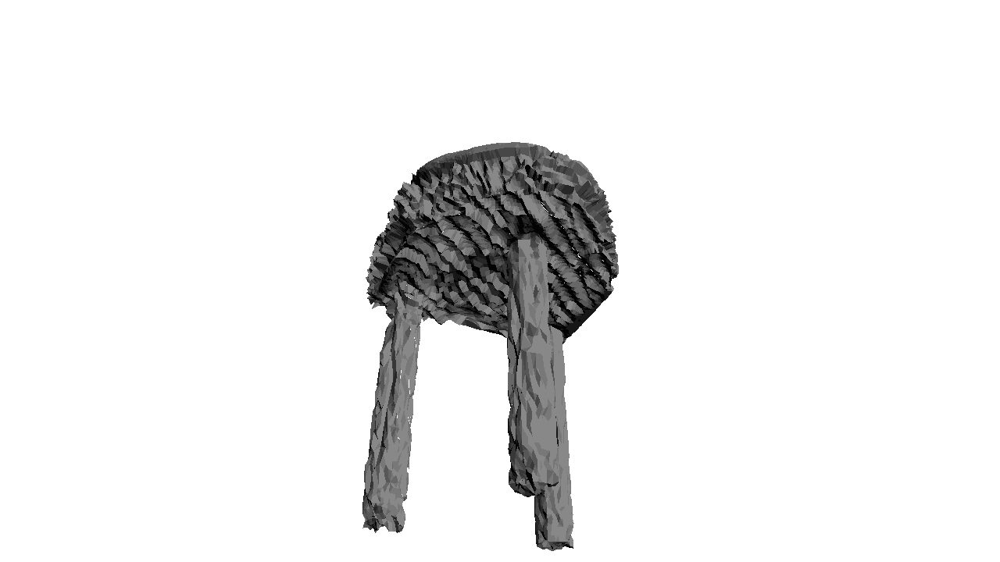

<center>

  

*examples of meshes yielded by _NSF_*

* * *

</center>

> In this work, we develop intuitive controls for editing
> the style of 3D objects. Our framework, Text2Mesh, stylizes a 3D mesh by predicting color and local geometric details which conform to a target text prompt. We consider
> a disentangled representation of a 3D object using a fixed
> mesh input (content) coupled with a learned neural network, which we term neural style field network. In order
> to modify style, we obtain a similarity score between a text
> prompt (describing style) and a stylized mesh by harnessing the representational power of CLIP. Text2Mesh requires
> neither a pre-trained generative model nor a specialized
> 3D mesh dataset. It can handle low-quality meshes (nonmanifold, boundaries, etc.) with arbitrary genus, and does
> not require UV parameterization. We demonstrate the ability of our technique to synthesize a myriad of styles over a
> wide variety of 3D meshes.


*The pipeline of our method*

## Morphs
_NSF_ is capable of generating small deformations over the same source mesh, based on different targets. Thus, it's very natural to morph different results.

| horse        | vase          | chair |
|:-------------|:------------------|:------|
|  |   |   |
|  |     |     |


## Citation
```
@article{Text2Mesh,
  title={Text2Mesh: Text-Driven Neural Stylization for Meshes},
  author={}
}
```