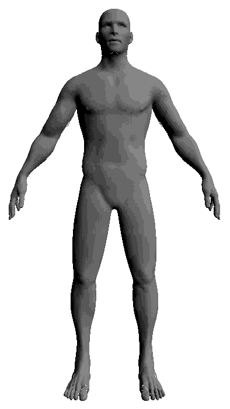
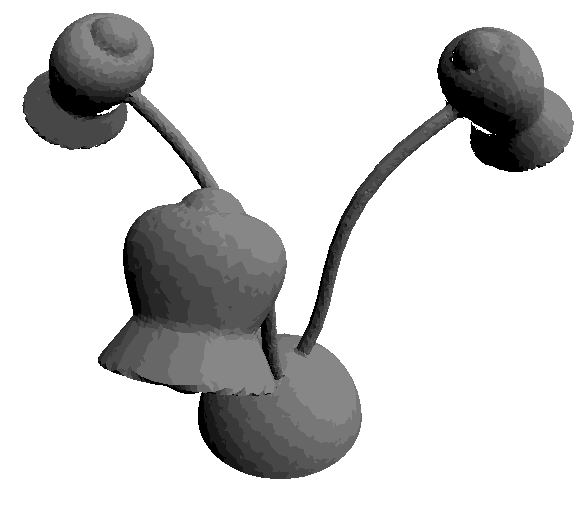
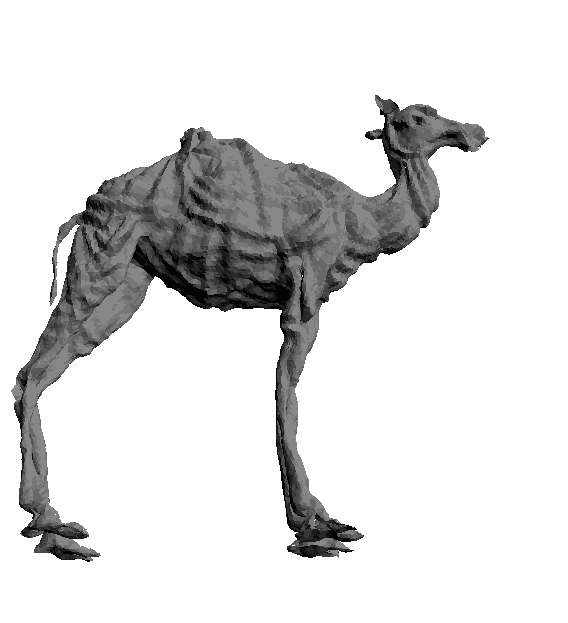

<center>

   
<p><em>
Text2Mesh produces color and geometric details over a variety of source meshes, driven by a target text prompt. Our stylization results coherently blend unique and ostensibly unrelated combinations of text, capturing both global semantics and part-aware attributes.
</em></p>

<a href="https://github.com/threedle/text2mesh" class="btn">Code</a>
<a href="https://www.dropbox.com/s/hbzq7xp95tr1788/text2mesh-preprint.pdf?dl=0" class="btn">Paper</a>
<a href="arxiv.com/supp" class="btn">Supplementary</a>

</center>

* * *

## Abstract

In this work, we develop intuitive controls for editing the style of 3D objects. Our framework, Text2Mesh, stylizes a 3D mesh by predicting color and local geometric details which conform to a target text prompt. We consider a disentangled representation of a 3D object using a fixed mesh input (content) coupled with a learned neural network, which we term neural style field network. In order to modify style, we obtain a similarity score between a text prompt (describing style) and a stylized mesh by harnessing the representational power of CLIP. Text2Mesh requires neither a pre-trained  generative model nor a specialized 3D mesh dataset. It can handle low-quality meshes (non-manifold, boundaries, etc.) with arbitrary genus, and does not require UV parameterization. We demonstrate the ability of our technique to synthesize a myriad of styles over a wide variety of 3D meshes.

## Overview
<center>

<p><em>Text2Mesh modifies an <span style="color: palegreen">input mesh</span> to conform to the <span style="color: palegreen">target text</span> by predicting color and geometric details. The weights of the <span style="color: sandybrown">neural style network</span> are optimized by <span style="color: royalblue">rendering</span> multiple 2D images and applying <span style="color: royalblue">2D augmentations</span>, which are given a similarity score to the target from the CLIP-based <span style="color: salmon">semantic loss</span>.</em></p>
</center>

## View Consistency
We use [CLIP's](https://openai.com/blog/clip/) ability to jointly embed text and images to produce view-consistent and semantically meaningful stylizations over the entire 3D shape.
<center>
<div class="carousel">
    <div class="item">
        
        <p>a croissant made of colorful crochet</p>
    </div>
    <div class="item">
        
        <p>armadillo made of gold</p>
    </div>
    <div class="item">
        
        <p>donkey wearing jeans</p>
    </div>
</div>
</center>
## General Stylization
For the same input mesh, Text2Mesh is capable of generating a variety of different local geometric displacements to synthesize a wide range of styles.
<center>
<div class="double-carousel">
    <div class="item">
        
        
    </div>
    <div class="item">
        
        
    </div>
    <div class="item">
        
        
    </div>
    <div class="item">
        
        
    </div>
    <div class="item">
        
        
    </div>
 </div>
</center>

[comment]: <> (## Interplay of Geometry and Color)

[comment]: <> (We observe a strong correlation between the displacements and the coloring that _NSF_ produces, which results in a consistent stylized 3D mesh.)

[comment]: <> (<center>)

[comment]: <> ( )

[comment]: <> (</center>)

## Beyond Text-Driven Manipulation
We further leverage the joint vision-language embedding space to demonstrate the multi-modal stylization capabilities of our method.

### Image and Mesh Targets
<center>
<div class="carousel">
    <div class="item">
        
        <p>image target</p>
    </div>
    <div class="item">
        
        <p>image target</p>
    </div>
    <div class="item">
        
        <p>image target</p>
    </div>
    <div class="item">
        
        <p>mesh target</p>
    </div>
 
 </div>
</center>

## Citation

```
@article{text2mesh,
    author = {Michel, Oscar
              and Bar-On, Roi
              and Liu, Richard
              and Benaim, Sagie
              and Hanocka, Rana
              },
    title = {{Text2Mesh: Text-Driven Neural Stylization for Meshes}},
    journal = {TODO: ARXIV},
    year  = {2021}
}
```